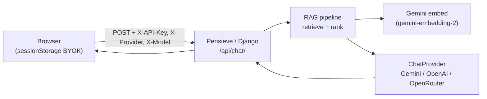

# Pensieve

**Grounded document Q&A** — a Django app that answers questions from your private docs. Visitors bring their own LLM API key (BYOK); the host only supplies Gemini for embeddings and retrieval. Portfolio demo of RAG, multi-provider chat, and client-side key handling.

> A pensieve holds memories so you can revisit them. This one holds your documents so you can query them.

## Problem

Teams and individuals often have small, private text corpora—policies, protocols, notes—where generic chatbots hallucinate or ignore the source material. Pensieve ingests local `.txt` files, embeds them with Gemini, retrieves the top matching chunks at query time, and injects that context into the user's chosen chat model. You get document-aware answers without uploading your docs to a third-party chat UI or storing user API keys on the server.

## Architecture



**Flow:** The browser sends the user message to `POST /api/chat/` with provider headers. Django loads session history from **Postgres**, runs retrieval (Gemini embeddings + **pgvector** cosine distance over stored chunks), builds a system prompt from the top hits, and calls the selected `ChatProvider`. The response and optional source metadata return as JSON; only message text is persisted—never the API key.

Django project package: `pensieve` · App: `chatbot`

## BYOK security model

| Layer | Behavior |
|-------|----------|
| **Browser** | API key, provider, and model live in `sessionStorage` (`byok_api_key`, `byok_provider`, `byok_model`). Cleared when the tab closes. |
| **Transport** | Key sent per request via `X-API-Key` header (along with `X-Provider` and `X-Model`). |
| **Server** | Key is read from headers, passed to the provider adapter, and **never written** to the database, logs, or disk. |

The host **does** hold `GEMINI_API_KEY` in `.env` for document/query embeddings only—that key never leaves the server and is not user-configurable in the UI.

## Providers

| Provider | Default model | API key from | Notes |
|----------|---------------|--------------|-------|
| **Gemini** | `gemini-2.5-flash` | [Google AI Studio](https://aistudio.google.com/app/apikey) | Native Google GenAI SDK |
| **OpenAI** | `gpt-4o-mini` | [OpenAI Platform](https://platform.openai.com/api-keys) | OpenAI-compatible chat completions |
| **OpenRouter** | `openai/gpt-4o-mini` | [OpenRouter](https://openrouter.ai/keys) | Same adapter, routed via OpenRouter base URL |

**Embeddings:** Always **Gemini** (`gemini-embedding-2`) using the server `GEMINI_API_KEY`, regardless of chat provider. Chunks are stored in **Postgres** with **pgvector** (`vector(3072)`); ingest (`ingest_docs.py`) and query-time retrieval both use this key.

## Quick start (local)

**Prerequisites:** Python 3.13+, Docker (for Postgres + pgvector), a Gemini API key (required for RAG), and a chat key from any supported provider.

```bash
git clone <repo-url> && cd pensieve
cd services/backend && uv sync && cd ../..

cp env/backend/.env.example .env
# Edit .env: set GEMINI_API_KEY and DJANGO_SECRET_KEY
# DATABASE_URL uses Compose Postgres on host port 5434

docker compose up -d db          # pgvector/pgvector:pg16
python run.py migrate
cd services/backend
uv run python ingest_docs.py
uv run python manage.py runserver 8001
```

Open [http://127.0.0.1:8001](http://127.0.0.1:8001), open **Settings**, paste your chat API key, pick a provider, and ask a question.

## Docker (app + DB)

```bash
cp env/backend/.env.example .env   # set GEMINI_API_KEY and DJANGO_SECRET_KEY
docker compose up --build
```

Compose starts Postgres (pgvector), Redis, and the web app. The container runs
migrations and serves on [http://localhost:8001](http://localhost:8001).
Host ports are **5434** for Postgres and **6380** for Redis.

## API keys

| Key | Who provides | Purpose |
|-----|--------------|---------|
| `GEMINI_API_KEY` | **Host** (`.env`) | Embed documents at ingest; embed queries at chat time |
| Chat API key | **User** (browser Settings) | LLM completion only—Gemini, OpenAI, or OpenRouter |

Get keys:

- **Gemini (host + optional chat):** [Google AI Studio](https://aistudio.google.com/app/apikey)
- **OpenAI (chat):** [platform.openai.com/api-keys](https://platform.openai.com/api-keys)
- **OpenRouter (chat):** [openrouter.ai/keys](https://openrouter.ai/keys)

## Evaluation

Golden-set retrieval eval lives in `evals/`:

```bash
./venv/bin/python ingest_docs.py
./venv/bin/python evals/run_eval.py
```

`evals/golden_qa.json` defines questions against `documents/spaceship_protocol.txt`. The script prints a per-question table and exits non-zero if positive retrieval hit rate falls below 80%.

**Known limitations** (chunking, scale, hallucination, citations): see [evals/FAILURES.md](evals/FAILURES.md).

## Cost model

- **Host pays:** Gemini embedding calls for ingest and every user query (server `GEMINI_API_KEY`).
- **User pays:** Chat completions on their chosen provider, billed to the key they paste in Settings.

For a public demo, keep the corpus small and rate-limit chat (`CHAT_RATE_LIMIT` in `.env`) so embedding cost stays bounded.

## Deploy (EC2 + GHCR)

App images are published to GHCR on every push to `main` (`.github/workflows/publish-ghcr.yml`):

- `ghcr.io/ashish4895/pensieve-backend` (API + Celery worker/beat via `entrypoint`)
- `ghcr.io/ashish4895/pensieve-nginx`

Tags: `latest` and `sha-<short>`. After the first publish, set each package visibility to **Public** (GitHub → Packages) so the EC2 host can pull without `docker login`. If packages stay private, create a read-only PAT and run `docker login ghcr.io` on the instance.

On the EC2 host (with Docker + Compose, enough disk, and a `.env`):

```bash
cd ~/pensieve
git pull
docker compose -f docker-compose.prod.yml pull
docker compose -f docker-compose.prod.yml up -d
```

Point `ALLOWED_HOSTS`, `CORS_ALLOWED_ORIGINS`, and `CSRF_TRUSTED_ORIGINS` at the instance public URL (e.g. `http://<eip>:8080`). Optional pin: `PENSIVE_IMAGE_TAG=sha-abcdef1`.

Local development still uses `docker compose up --build` (build from `docker/*`).

## Screenshots

<!-- Replace with actual screenshots when deploying -->

| Chat UI | Settings (BYOK) |
|---------|-----------------|
|  |  |

> Placeholder paths—add captures under `docs/screenshots/` before publishing.

## API reference

| Endpoint | Method | Description |
|----------|--------|-------------|
| `/api/chat/` | POST | Send message; requires `X-API-Key`, optional `X-Provider`, `X-Model` |
| `/api/history/` | GET | Session message history |
| `/api/clear/` | POST | Clear session history |

## License & disclaimer

Personal portfolio / learning project—not production software. Provided **as-is** with no warranty. Use at your own risk; review provider terms and never commit `.env` or real API keys. Not affiliated with Google, OpenAI, OpenRouter, or Wizarding World / Harry Potter IP—the name is used metaphorically.
